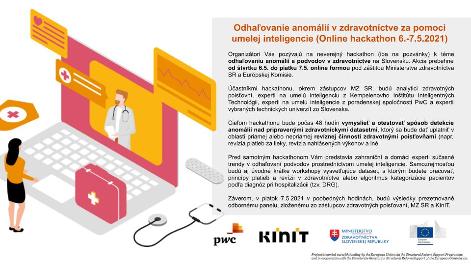
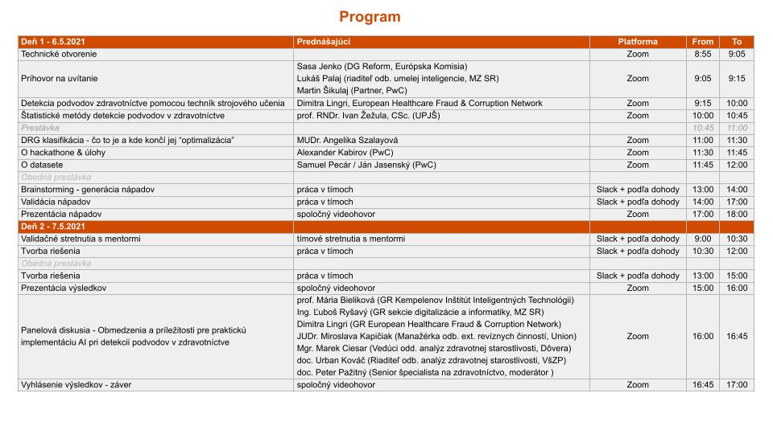

# Hackaton: Odhaľovanie anomálií v zdravotníctve za pomoci umelej inteligencie 2021

- Miesto konania: Online
- Dátum konania: 6-7.5.2021

## Pozvánka

## Program

## Podmienky účasti

Plné znenie podmienok účasti na Hackathone je dostupné na stránke wiki v
časti [Podmienky účasti](https://github.com/National-project-of-AI-adoption-in-HC/Hackaton_2021/wiki/Podmienky-%C3%BA%C4%8Dasti)

## Rozdelenie do tímov

Rozdelenie účastníkov do jednotlivých tímov je dostupné na stránke wiki v
časti [Tímy](https://github.com/National-project-of-AI-adoption-in-HC/Hackaton_2021/wiki/T%C3%ADmy)

## Opis Dát

Opis dát je dostupný aj na stránke wiki v časti [Opis Dát](https://github.com/National-project-of-AI-adoption-in-HC/Hackaton_2021/wiki/Opis-D%C3%A1t)

## FAQ

Odpovede na najčastejšie otázky sú dostupné na stránke wiki v časti [FAQ](https://github.com/National-project-of-AI-adoption-in-HC/Hackaton_2021/wiki/FAQ)
